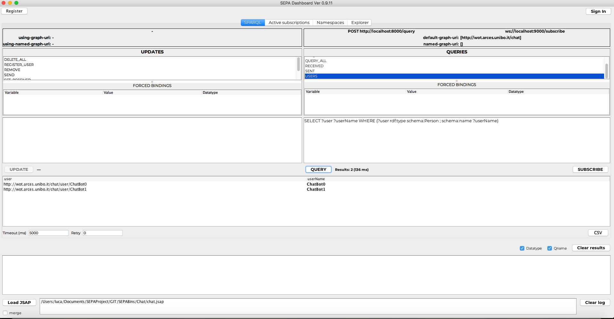
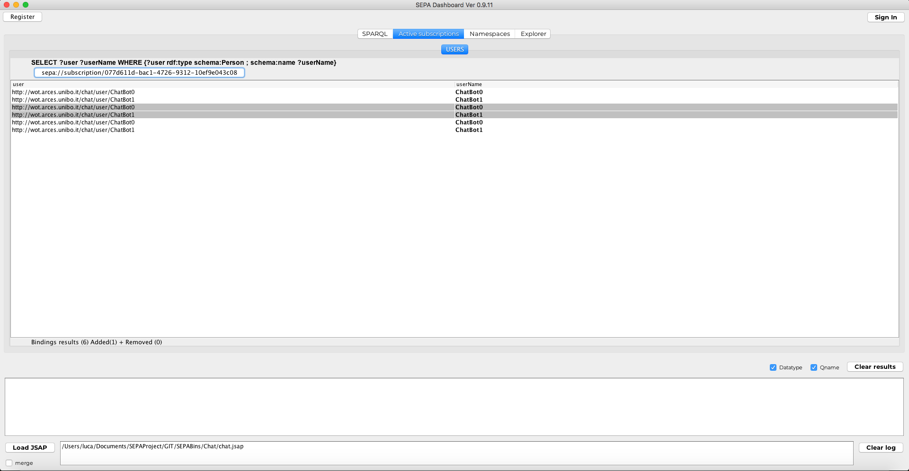

The repository includes all you need to test SEPA, a publish-subscribe architecture designed to support information level interoperability by means of Semantic Web technologies. The architecture is built on top of a generic SPARQL endpoint where publishers and subscribers use standard **SPARQL** [Updates](https://www.w3.org/TR/sparql11-update/) and [Queries](https://www.w3.org/TR/sparql11-query/). Notifications about events (i.e., changes in the [**RDF**](https://www.w3.org/RDF/) knowledge base) are expressed in terms of [added and removed SPARQL binding results](http://mml.arces.unibo.it/TR/sparql11-subscribe.html) since the previous notification. 

Developers can benefit of a set of API implementing a [Producer-Aggregator-Consumer design pattern](http://mml.arces.unibo.it/TR/jsap.html).

For more details on the current implementation and how you can contribute please follow this [link](https://github.com/arces-wot/SEPA).

# Installation
Clone the repository: `git clone https://github.com/arces-wot/SEPABins.git`

# Usage
The SEPA broker needs to connect to a SPARQL endpoint supporting the [SPARQL 1.1 Protocol](https://www.w3.org/TR/sparql11-protocol/). For you convenience, the repository includes an instance of [Blazegraph](https://www.blazegraph.com/).

## Start the SPARQL endpoint
From a command shell move to the `Endpoint` folder and run the endpoint: `java -jar blazegraph.jar`

If Blazegraph started correctly, you would see something like the following:

```
Welcome to the Blazegraph(tm) Database.

Go to http://192.168.1.11:9999/blazegraph/ to get started.
```
Otherwise, Blazegraph failed to start. This can be due to the JRE version: If you are using Java 9, try forcing the use of Java 8 JRE: `/Library/Java/JavaVirtualMachines/jdk1.8.0_65.jdk/Contents/Home/bin/java -jar blazegraph.jar`

In any case, please refer to the [Blazegraph web site](https://www.blazegraph.com/) to download and run the last version (the one we provide is just for the purpose of quickly testing SEPA and may not be updated).

## Start the SEPA broker
From a command shell, move to the `Engine` folder and type: `java -Dlog4j.configurationFile=./log4j2.xml -jar engine-0-SNAPSHOT.jar`

The following welcome message would be displayed:

```
##########################################################################################
#                           ____  _____ ____   _                                         #
#                          / ___|| ____|  _ \ / \                                        #
#                          \___ \|  _| | |_) / _ \                                       #
#                           ___) | |___|  __/ ___ \                                      #
#                          |____/|_____|_| /_/   \_\                                     #
#                                                                                        #
#                     SPARQL Event Processing Architecture                               #
#                                                                                        #
#                                                                                        #
# This program comes with ABSOLUTELY NO WARRANTY                                         #
# This is free software, and you are welcome to redistribute it under certain conditions #
# GNU GENERAL PUBLIC LICENSE, Version 3, 29 June 2007                                    #
#                                                                                        #
#                                                                                        #
# @prefix git: <https://github.com/> .                                                   #
# @prefix dc: <http://purl.org/dc/elements/1.1/> .                                       #
#                                                                                        #
# git:arces-wot/sepa dc:title 'SEPA' ;                                                   #
# dc:creator git:lroffia ;                                                               #
# dc:contributor git:relu91 ;                                                            #
# dc:format <https://java.com> ;                                                         #
# dc:publisher <https://github.com> .                                                    #
##########################################################################################

SPARQL 1.1 endpoint
----------------------
SPARQL 1.1 Query     | http://localhost:9999/blazegraph/namespace/kb/sparql (Method: POST)
SPARQL 1.1 Update    | http://localhost:9999/blazegraph/namespace/kb/sparql (Method: POST)
----------------------

SPARQL 1.1 Protocol (https://www.w3.org/TR/sparql11-protocol/)
----------------------
SPARQL 1.1 Query     | http://192.168.1.3:8000/query
SPARQL 1.1 Update    | http://192.168.1.3:8000/update
----------------------

SPARQL 1.1 SE Protocol (http://mml.arces.unibo.it/TR/sparql11-se-protocol.html)
----------------------
SPARQL 1.1 Subscribe | ws://192.168.1.3:9000/subscribe
----------------------

*****************************************************************************************
*                      SEPA Broker Ver 1.0.0 is up and running                          *
*                                Let Things Talk!                                       *
*****************************************************************************************
```

To close the broker just type `CTRL+X`:

```
Stopping HTTP gate...
Stopping WebSocket gate...
Stopping Processor...
Stopped...bye bye :-)
```
# Play with SEPA
SEPA applications are built around the [JSON Semantic Application Profile (JSAP)](http://mml.arces.unibo.it/TR/jsap.html).  A demo application can be found in the `Apps/mqtt` folder. The JSAP file is named `arces-demo.jsap`. From a command shell, move to the `Apps/mqtt` folder and type: `java -jar MQTTDemo.jar arces-demo.jsap`

The output should look like:

```
2018-10-24T09:45:51,083 [INFO ] main (MQTTDemo.java:46) Parse places
2018-10-24T09:45:51,094 [INFO ] main (MQTTDemo.java:52) Add places
2018-10-24T09:45:51,128 [INFO ] main (MQTTDemo.java:71) Parse places' links
2018-10-24T09:45:51,137 [INFO ] main (MQTTDemo.java:78) Link places
2018-10-24T09:45:51,148 [INFO ] main (MQTTDemo.java:96) Parse semantic mappings
2018-10-24T09:45:51,158 [INFO ] main (MQTTDemo.java:103) Add observations
2018-10-24T09:45:51,322 [INFO ] main (MQTTDemo.java:127) Create observation logger
2018-10-24T09:45:51,352 [INFO ] main (WebsocketSubscriptionProtocol.java:103) Connect to: ws://localhost:9000/subscribe
2018-10-24T09:45:51,661 [INFO ] Grizzly(1) (WebsocketSubscriptionProtocol.java:166) @onOpen session: b8de0aae-2f75-401d-94d7-42c04feb86d1
2018-10-24T09:45:51,670 [INFO ] main (MQTTDemo.java:131) Create observation updater
2018-10-24T09:45:51,691 [INFO ] main (WebsocketSubscriptionProtocol.java:103) Connect to: ws://localhost:9000/subscribe
2018-10-24T09:45:51,698 [INFO ] Grizzly(1) (WebsocketSubscriptionProtocol.java:166) @onOpen session: 7c995402-bd01-4b28-b13a-8a12ec485862
2018-10-24T09:45:51,700 [INFO ] main (WebsocketSubscriptionProtocol.java:103) Connect to: ws://localhost:9000/subscribe
2018-10-24T09:45:51,711 [INFO ] Grizzly(1) (WebsocketSubscriptionProtocol.java:166) @onOpen session: ae8e4a55-dee7-45e6-8dcc-dd78981b1cb2
2018-10-24T09:45:51,714 [INFO ] main (MQTTDemo.java:135) Create MQTT adapter
2018-10-24T09:45:51,734 [INFO ] main (MQTTDemo.java:138) Press any key to exit...
```

The application is configured to simulate MQTT messages. For each new MQTT message, a line like the following is printed:

```
2018-10-24T09:45:51,734 [INFO ] Thread-1 (MQTTAdapter.java:76) [Simulate MQTT message] Topic: 5CCF7F1B599E/temperature Value: 29.72
```

SEPA comes with a dashboard that provides all the functionalities need to interact with a SEPA broker (using JSAP files). In the `Tools` folder double click on `Dashboard_X_Y_Z.jar` or run it from a command shell as: `java -jar Dashboard_X_Y_Z.jar` 

Now, let's use the dashboard to query the values of the observations produced by the running demo:

1. Click on the `Load JSAP` button. Move to the `Apps/mqtt` and locate the `arces-demo.jsap`. Open it.
2. Query for observations: select `OBSERVATIONS` on the right list box and click `QUERY`



What you have done can be done with a common SPARQL endpoint. But SEPA can do more...press `SUBSCRIBE`. A new tab is opened with the notifications on sensor data changes. Grey lines indicate "old" values, while white lines indicate "new" values.




